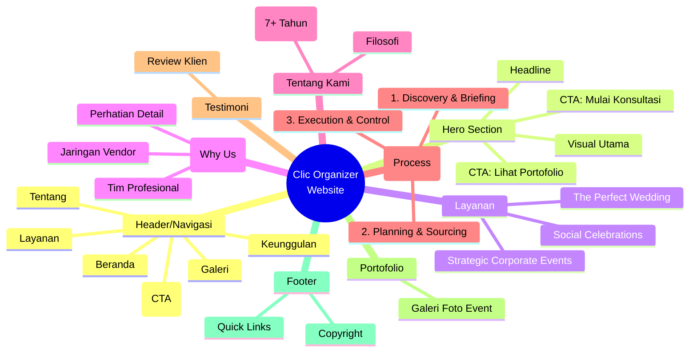
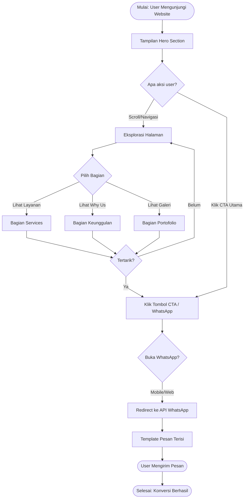
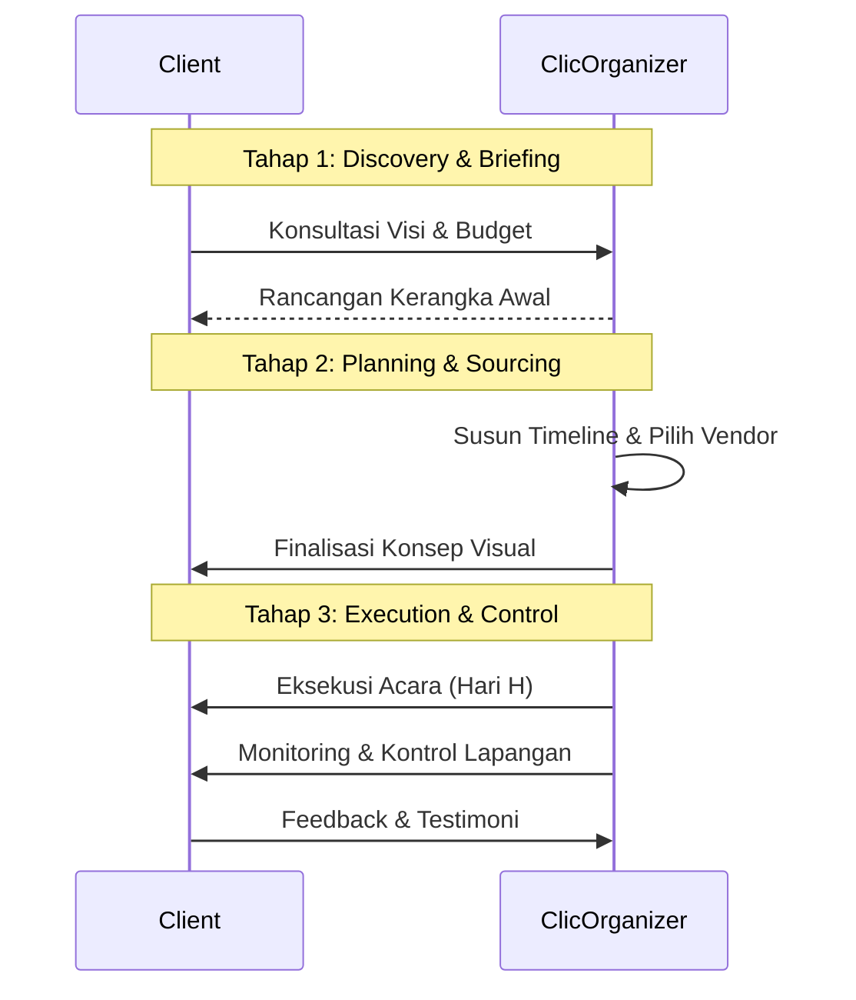

# Diagram Proposal Clic Organizer

Berikut adalah beberapa diagram yang merepresentasikan struktur dan alur dari website Clic Organizer yang telah dibuat. Diagram ini dapat digunakan untuk kebutuhan proposal teknis maupun pengembangan.

## 1. Diagram Sitemap (Struktur Website)
Diagram ini menggambarkan struktur konten yang ada pada Landing Page (Single Page Application).

## 2. Diagram Alur Pengguna (User Flow)
Diagram ini menggambarkan perjalanan pengguna (user journey) saat mengunjungi website hingga melakukan aksi konversi (menghubungi via WhatsApp).

## 3. Diagram Alur Bisnis (Process Flow)
Diagram ini menggambarkan "3 Langkah Menuju Kesuksesan" yang dijelaskan dalam konten website, relevan untuk proposal bisnis.

